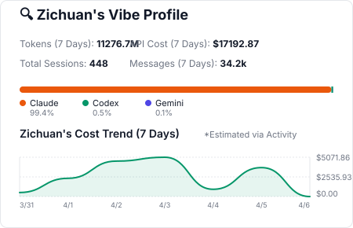

### About me 👏

Here is River(Zichuan) Li. I'm a ~~first/second/~~/third-year Ph.D. student at University of Illinois Urbana-Champaign, majoring in Computer Science.

In general, my research area is Computer System/Software Security.

I am interested in uncovering novel attack surfaces and vulnerabilities in real-world systems and leveraging program analysis and machine learning techniques to automatically discover them.

When I'm free, I enjoy [reading](https://book.douban.com/people/176314301/), watching [movies](https://movie.douban.com/people/176314301/) and [animations](https://bangumi.tv/user/573381).

Check out my [academic page](https://zichuan.li), and my [blog](https://hack1s.fun). 

Feel free to contact me via [Telegram](https://t.me/river_li), [email](mailto:lizic0228@gmail.com) or [Twitter](https://twitter.com/Ri7erLi).

I am a strong believer in AI-assisted coding/research/bug-hunting. I am trying to maximize the usage of AI in my daily work.

